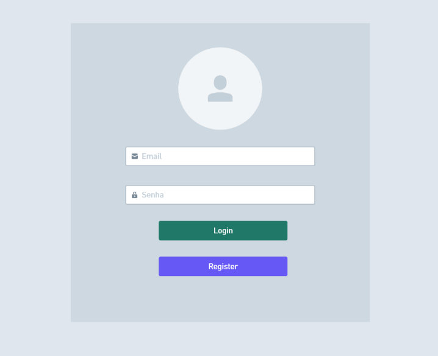

# Proposta de Trabalho Final

**Discente:** João Vitor Soares Henriques  
**Matrícula:** 22.2.8998  

---

## 1. Tema
O presente trabalho tem como objetivo o desenvolvimento de um **Sistema de Gestão de Crédito e Cobrança para Pequenos Negócios**.

A proposta consiste em criar uma solução que permita o controle eficiente de clientes, a concessão de crédito e o acompanhamento de pagamentos, sendo especialmente útil para empresas que operam com vendas a prazo ou financiamento direto ao consumidor.

O sistema deverá possibilitar o registro, consulta e gerenciamento das operações de crédito, além de incorporar mecanismos de avaliação de risco que auxiliem na tomada de decisão para liberação de novos créditos. Também serão aplicadas técnicas de validação de dados e geração de identificadores únicos, garantindo a integridade e a segurança das informações.

---

## 2. Escopo
O sistema proposto contemplará as seguintes funcionalidades:

### 2.1 Gestão de Clientes
* **Cadastro de informações:**
    * Nome completo
    * CPF/CNPJ
    * Endereço
    * Dados de contato
* **Persistência:** Possibilidade de armazenamento de clientes mesmo sem operações de crédito vinculadas.
* **Manutenção:** Atualização e consulta dos dados cadastrais.

### 2.2 Gestão de Operações de Crédito
* **Registro de operações contendo:**
    * Valor concedido
    * Prazo de pagamento
    * Taxa de juros aplicada
    * Classificação do cliente (pessoa física ou jurídica)
* **Identificação:** Geração de identificadores únicos para cada operação.
* **Vínculo:** Associação de operações de crédito a clientes cadastrados.
* **Consulta:** Visualização e atualização das informações das operações.

### 2.3 Avaliação de Risco de Crédito
* Implementação de critérios para análise da capacidade de pagamento dos clientes.
* **Definição de limites de crédito com base em:**
    * Histórico financeiro
    * Perfil do cliente
* Aplicação de regras que impeçam a concessão de crédito fora dos critérios estabelecidos.

### 2.4 Relatórios e Monitoramento
* **Geração de relatórios contendo:**
    * Operações de crédito ativas
    * Operações de crédito finalizadas
* **Identificação de status:**
    * Pagamentos pendentes
    * Pagamentos em atraso
* Visualização consolidada das operações por cliente.

### 2.5 Recursos Complementares
* Implementação de sistema de autenticação para controle de acesso administrativo.
* Desenvolvimento de interface para navegação e gerenciamento dos dados.
* Disponibilização de painel geral para acompanhamento das operações e clientes.

## 3. Protótipo da Interface
Para ilustrar a experiência do usuário e a estrutura visual do sistema, foram desenvolvidos protótipos das principais telas, focando em usabilidade e clareza das informações.

### 3.1 Autenticação e Acesso
A porta de entrada do sistema conta com uma interface limpa para login e registro, garantindo que apenas usuários autorizados acessem os dados sensíveis de crédito e clientes.



### 3.2 Cadastro de Clientes
O formulário de cadastro permite a distinção entre Pessoa Jurídica e Física, coletando dados essenciais para a análise de risco, como CPF/CNPJ e renda mensal, de forma organizada.


### 3.3 Dashboard e Gestão Operacional
O painel principal oferece uma visão consolidada do negócio, apresentando métricas críticas (valores totais e status de empréstimos) e uma tabela interativa para busca, filtragem e acompanhamento detalhado das operações de crédito ativas e pendentes.


---

## 4. Instalacao e Execucao

### 4.1 Pre-requisitos

Para executar o sistema localmente, e necessario ter instalado:

* PHP 8.4
* Composer
* Node.js e npm
* SQLite ou outro banco configurado no Laravel

### 4.2 Passos para executar

1. Clone ou baixe o repositorio.

2. Acesse a pasta do projeto:

```bash
cd nome-da-pasta-do-projeto
```

3. Instale as dependencias do Laravel:

```bash
composer install
```

4. Instale as dependencias do frontend:

```bash
npm install
```

5. Copie o arquivo de ambiente:

```bash
cp .env.example .env
```

No Windows, tambem e possivel copiar manualmente o arquivo `.env.example` e renomear para `.env`.

6. Gere a chave da aplicacao:

```bash
php artisan key:generate
```

7. Configure o banco de dados no arquivo `.env`.

Para uso local simples com SQLite:

```env
DB_CONNECTION=sqlite
DB_DATABASE=database/database.sqlite
```

Depois, crie o arquivo `database/database.sqlite`.

8. Execute as migrations:

```bash
php artisan migrate
```

9. Gere os arquivos do frontend:

```bash
npm run build
```

10. Inicie o servidor local:

```bash
php artisan serve
```

Depois acesse:

```text
http://127.0.0.1:8000
```

---

## 5. Forma de Uso do Sistema

### 5.1 Cadastro e Login

Ao acessar o sistema, o usuario pode criar uma conta ou realizar login. As funcionalidades principais ficam disponiveis apenas para usuarios autenticados, garantindo que os dados de clientes e emprestimos fiquem vinculados ao usuario logado.

### 5.2 Cadastro de Clientes

Apos entrar no sistema, o primeiro passo e cadastrar um cliente. O formulario solicita informacoes como nome, CPF, telefone, renda mensal e profissao. Esses dados sao usados para organizar os clientes e tambem para auxiliar na analise de risco de credito.

### 5.3 Cadastro de Emprestimos

Com um cliente cadastrado, o usuario pode registrar um novo emprestimo. No cadastro, sao informados:

* cliente vinculado;
* valor do emprestimo;
* quantidade de parcelas;
* tipo de juros;
* percentual de juros;
* data de contratacao;
* data de vencimento da primeira parcela;
* finalidade do emprestimo;
* garantia, quando houver.

Antes de salvar o emprestimo, o usuario pode utilizar a opcao de simulacao para avaliar o risco da operacao. O sistema retorna o nivel de risco, uma taxa recomendada e uma recomendacao baseada nos dados informados.

### 5.4 Dashboard

O dashboard apresenta uma visao geral dos emprestimos cadastrados. Nele e possivel consultar os emprestimos, visualizar status, filtrar por cliente, periodo e situacao, alem de acompanhar as parcelas vinculadas a cada operacao.

### 5.5 Pagamento de Parcelas

Na tela de pagamento, o usuario seleciona um cliente e visualiza os emprestimos em aberto. Ao abrir as parcelas, e possivel registrar o pagamento de uma parcela pendente ou atrasada. Quando todas as parcelas sao pagas, o emprestimo e marcado como quitado.

### 5.6 Fluxo Principal

O fluxo basico de uso do sistema e:

1. Criar conta ou fazer login.
2. Cadastrar um cliente.
3. Cadastrar um emprestimo para esse cliente.
4. Simular o risco do emprestimo.
5. Acompanhar o emprestimo no dashboard.
6. Registrar o pagamento das parcelas.
7. Consultar o status atualizado do emprestimo.
